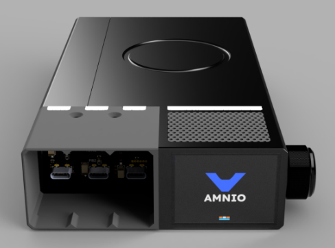

# What is Stratum?

**Stratum** is a smart, modular battery bank built for hackers, engineers, and power users who need **serious portable power** — and the ability to tweak, upgrade, or repair it themselves.
Stratum lets you **swap ports and cells without tools**, enabling deep customization without any fuss.

Unlike traditional battery packs, Stratum is:

* 🔌 **Port-Swappable** – Add, remove, or upgrade ports (USB-C, USB-A, DC barrel, etc.) with **snap-in modules**.
* 🔋 **Cell-Swappable** – Drop in new 18650 cells with **no soldering or disassembly**.
* 🧠 **Smart** – Real-time diagnostics, per-cell monitoring, and intelligent power management via the ESP32-S3.
* 🛡️ **Safe** – Includes active balancing, thermal sensors, and cutoff protection for faulty or unsafe cells.
* 📟 **Readable** – A 2" high-resolution display provides live stats: voltage, current, cell health, and more.

Stratum is part of the **Amnio** ecosystem: an open hardware platform focused on **repairable**, **modular**, and **developer-friendly** electronics.

---

## What else is in this repo?

This repo is evolving into a **monorepo for both hardware and software tools** under Amnio:

### LVScope (desktop-runner)
A visual editor and debug interface for embedded UI development (LVGL-based). It’s designed to help firmware engineers **build and inspect UIs more efficiently**, using a modern desktop interface.

LVScope is still VERY early in development. Right now, it includes:

- A Rust-based cross-platform desktop GUI using a lightweight renderer that allows panning and zooming of embedded LVGL projects.
- Efficient hot-reloading for embedded UI projects (rebuilds in <1 second).
- An LVGL object tree viewer

We hope to soon have live property editing (position, size, colors, and more) as well as VSCode integration and more advanced diagnostic data. A CLI for getting projects set up quickly is also on the roadmap. Stay tuned!

We’re actively working toward a smoother integration between LVScope and Stratum’s firmware tooling. Expect rough edges as we iterate.

---

Stratum and LVScope are part of a broader mission:  
**Make embedded systems more transparent, tweakable, and developer-friendly -- from the firmware to the front panel.**
